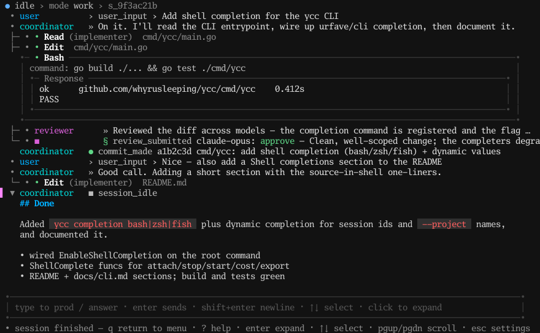

# ycc

A docs-driven coding harness: a coding agent that works from a `spec.md` and a
backlog of tasks. `ycc` is a single binary that is **client, TUI, and daemon** in
one.

- With **no subcommand** it launches the interactive TUI (the home menu).
- Subcommands (`start`, `attach`, `list`, `cost`, …) drive sessions from the
  command line and stream their event logs.
- `ycc daemon` runs the explicit, persistent, foreground service.

See [`spec.md`](spec.md) for the full design and [`docs/cli.md`](docs/cli.md) for
the complete command reference.



*The interactive TUI streaming a work session (user turn, model turns, collapsed
Read/Edit/Bash tool calls, and the final report). Rendered deterministically by
the built-in snapshot renderer — regenerate with `YCC_README_SCREENSHOT_DIR=docs
go test ./internal/tui -run TestGenerateReadmeScreenshot`.*

## Install / build

```sh
go install github.com/whyrusleeping/ycc/cmd/ycc@latest   # install to $GOBIN
go build -o ycc ./cmd/ycc                                 # or build in-tree
```

### Shell completions

`ycc` ships completion scripts for bash, zsh, and fish (run
`ycc completion --help` for Powershell and details). Source the script for your
shell — `ycc attach`/`ycc stop` then complete against live session ids and
`--project` completes registered project names when a daemon is reachable:

```sh
source <(ycc completion bash)                          # ~/.bashrc
source <(ycc completion zsh)                            # ~/.zshrc
ycc completion fish > ~/.config/fish/completions/ycc.fish
```

## Quick start

```sh
# Interactive TUI (runs a one-shot in-process daemon, torn down on exit):
ycc

# Start a session from the CLI and stream it; type lines to prod the agent:
ycc start "add a hello.txt"

# Re-attach to a running session, replaying its log from the start:
ycc attach s_abc123 --from 0

# List sessions / modes:
ycc list
ycc modes

# Usage & cost breakdown (by backlog task, by default):
ycc cost --by task --since 2026-06-01
```

Every command is self-documenting — run `ycc --help` for the command list and
`ycc <command> --help` for any command's flags and arguments.

## Persistence model

Persistence is **opt-in**:

- **Default** (`ycc`, `ycc start …`): if a persistent local daemon is already
  running, attach to it; otherwise start the daemon **in-process** on an ephemeral
  loopback address tied to this process. It is torn down when the process exits —
  closing `ycc` ends any in-flight agent work.
- **`ycc --background`**: spawn a detached, persistent daemon and attach to it, so
  work keeps running after the client exits.
- **`ycc daemon`**: run the persistent daemon explicitly in the foreground.
- **`ycc --addr <URL>`**: attach to a remote/explicit daemon.

## Configuration

`ycc` looks for a TOML config (`ycc.toml`) describing model providers and
workflow roles. It is discovered in this order:

1. `./ycc.toml` (the workspace directory)
2. `$XDG_CONFIG_HOME/ycc/ycc.toml` (typically `~/.config/ycc/ycc.toml`)

Launching the TUI with no usable config runs a first-run setup wizard that writes
`~/.config/ycc/ycc.toml`. You can also pass an explicit file with `--config`.

## Secrets & environment

API keys are resolved from the **environment first**, then a machine-local
secrets store managed with `ycc token` (values are read from stdin, never from
argv, so they don't land in shell history):

```sh
ycc token set ANTHROPIC_API_KEY   # paste at the prompt, or pipe the value in
ycc token set EXA_API_KEY
ycc token list
ycc token rm EXA_API_KEY
```

| Variable            | Used for |
|---------------------|----------|
| `ANTHROPIC_API_KEY` | default LLM backend key (the `key_env` configured per model) |
| `EXA_API_KEY`       | the `web_search` / `fetch_page` tools (Exa) |
| `YCC_TOKEN`         | bearer token for `--addr` / `ycc daemon` auth |

## Tests

```sh
go test ./...
```
