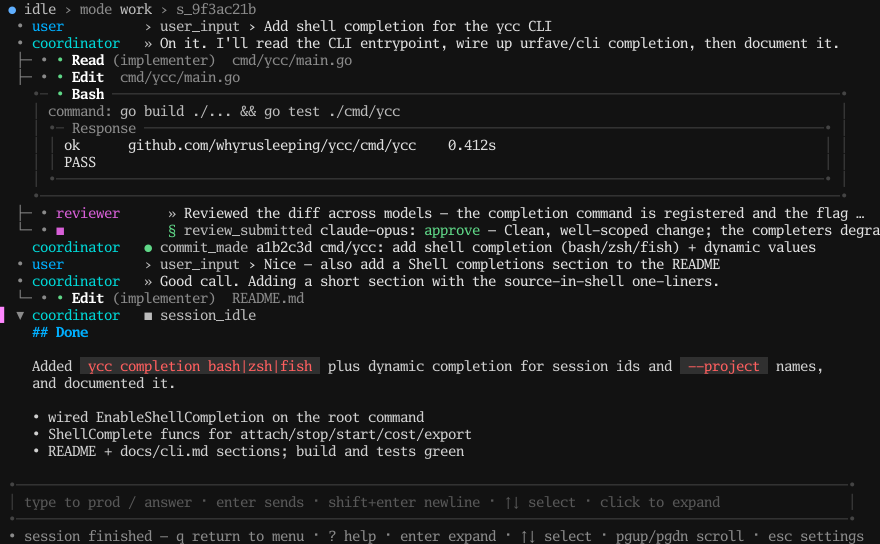

# ycc

A docs-driven coding harness: a coding agent that works from a `spec.md` and a
backlog of tasks. `ycc` is a single binary that is **client, TUI, and daemon** in
one.

- With **no subcommand** it launches the interactive TUI (the home menu).
- Subcommands (`start`, `attach`, `list`, `cost`, …) drive sessions from the
  command line and stream their event logs.
- `ycc daemon` runs the explicit, persistent, foreground service.

See [`spec.md`](spec.md) for the full design, [`docs/cli.md`](docs/cli.md) for
the complete command reference, and [`CONTRIBUTING.md`](CONTRIBUTING.md) for the
project's lean engineering standards.



*The interactive TUI streaming a work session (user turn, model turns, collapsed
Read/Edit/Bash tool calls, and the final report). Rendered deterministically by
the built-in snapshot renderer — regenerate with `YCC_README_SCREENSHOT_DIR=docs
go test ./internal/tui -run TestGenerateReadmeScreenshot`.*

## Install / build

```sh
go install github.com/whyrusleeping/ycc/cmd/ycc@latest   # install to $GOBIN
go build -o ycc ./cmd/ycc                                 # or build in-tree
```

### Shell completions

`ycc` ships completion scripts for bash, zsh, and fish (run
`ycc completion --help` for Powershell and details). Source the script for your
shell — `ycc attach`/`ycc stop` then complete against live session ids and
`--project` completes registered project names when a daemon is reachable:

```sh
source <(ycc completion bash)                          # ~/.bashrc
source <(ycc completion zsh)                            # ~/.zshrc
ycc completion fish > ~/.config/fish/completions/ycc.fish
```

## Quick start

```sh
# Interactive TUI (runs a one-shot in-process daemon, torn down on exit):
ycc

# Start a session from the CLI and stream it; type lines to prod the agent:
ycc start "add a hello.txt"

# Re-attach to a running session, replaying its log from the start:
ycc attach s_abc123 --from 0

# List sessions / modes:
ycc list
ycc modes

# Usage & cost breakdown (by backlog task, by default):
ycc cost --by task --since 2026-06-01
```

Every command is self-documenting — run `ycc --help` for the command list and
`ycc <command> --help` for any command's flags and arguments.

## Persistence model

Persistence is **opt-in**:

- **Default** (`ycc`, `ycc start …`): if a persistent local daemon is already
  running, attach to it; otherwise start the daemon **in-process** on an ephemeral
  loopback address tied to this process. It is torn down when the process exits —
  closing `ycc` ends any in-flight agent work.
- **`ycc --background`**: spawn a detached, persistent daemon and attach to it, so
  work keeps running after the client exits.
- **`ycc daemon`**: run the persistent daemon explicitly in the foreground.
- **`ycc --addr <URL>`**: attach to a remote/explicit daemon.

## Configuration

`ycc` looks for a TOML config (`ycc.toml`) describing model providers and
workflow roles. It is discovered in this order:

1. `./ycc.toml` (the workspace directory)
2. `$XDG_CONFIG_HOME/ycc/ycc.toml` (typically `~/.config/ycc/ycc.toml`)

Launching the TUI with no usable config runs a first-run setup wizard that writes
`~/.config/ycc/ycc.toml`. You can also pass an explicit file with `--config`.

### Design-document set

Projects with normative design documents beyond `spec.md` declare them in the committed
`.ycc/config.toml` project config:

```toml
spec_path = "spec.md"
doc_globs = ["docs/*.md", "docs/design/*.md"]
```

Keep runtime state ignored while making that one file committable with `.gitignore` rules such
as `.ycc/*` followed by `!.ycc/config.toml`. Use narrow globs for normative documents; do not
include `memory.md`, `backlog/`, generated files, or advisory reports. `ycc spec-check` scans the
entry point and every matching file.

## Secrets & environment

Never paste credentials into a session prompt or an `ask_user` answer: those
strings are durable model history. Use the local secret-entry command instead.
Interactive entry disables terminal echo; stdin is supported for password-manager
pipes, and values are never accepted in argv:

```sh
ycc token set ANTHROPIC_API_KEY
ycc token set EXA_API_KEY
ycc token list
ycc token rm EXA_API_KEY
```

Model backend credentials named by `key_env` are resolved from the daemon
environment first and then this machine-local store. Stored values are not added
to tool process environments and there is no model-visible secret lookup tool.
The only model-visible named-secret consumers are currently the Exa tools. Each
stored-secret use requires a separate authorization scoped to the canonical
workspace and one tool invocation:

```sh
ycc token authorize EXA_API_KEY --tool web_search --workspace /path/to/project
ycc token authorize EXA_API_KEY --tool fetch_page --workspace /path/to/project
ycc token authorizations   # reference-only grant/use audit; never values
```

An `EXA_API_KEY` deliberately placed in the daemon environment is already
operator-authorized for that daemon process; use the stored-secret workflow when
single-use tool authorization is wanted.

YCC refuses high-confidence credential-shaped prompts and question answers before
recording them, and exports and routine CLI event displays redact exact stored
values plus a few obvious credential shapes with a visible warning. These are
guardrails, not perfect secret detection:
arbitrary prompts, files, shell commands, tool output, web content, screenshots,
or unfamiliar credential formats can still leak values. YCC does not regex-rewrite
durable events because doing so could silently corrupt model replay.

If a credential was previously entered into a session, rotate/revoke it at the
provider first. Then choose deliberately: retain the owner-only session log for
replay, delete the entire affected `.ycc/sessions/<session-id>` directory while the
daemon is stopped (losing that session's replay/export), or make a separately
redacted copy for sharing. Hand-editing `events.jsonl` trades away append-only
history integrity and may break replay; YCC never edits or deletes old logs
automatically.

| Variable            | Used for |
|---------------------|----------|
| `ANTHROPIC_API_KEY` | default LLM backend key (the `key_env` configured per model) |
| `EXA_API_KEY`       | the `web_search` / `fetch_page` tools (Exa) |
| `YCC_TOKEN`         | bearer token for `--addr` / `ycc daemon` auth |

## Contributor checks

CI uses Go 1.26.8 on Linux and Xcode 16.4 on macOS. Run the corresponding local checks before
submitting a change (the Swift checks require macOS):

```sh
# Go formatting, static checks, uncached tests, PTY TUI tests, race detector, and docs drift.
test -z "$(git ls-files '*.go' | xargs gofmt -l)"
go vet ./...
go test -count=1 ./...
go test -count=1 -v ./internal/e2e   # every TestE2E test must PASS, not SKIP
go test -race -count=1 ./...
go run ./cmd/ycc spec-check

# Vulnerability scan (the Go patch version is part of the result).
go install golang.org/x/vuln/cmd/govulncheck@v1.8.0
govulncheck ./...

# Protobuf reproducibility; the remote Swift plugins are pinned in buf.gen.swift.yaml.
go install github.com/bufbuild/buf/cmd/buf@v1.71.0
go install google.golang.org/protobuf/cmd/protoc-gen-go@v1.36.11
go install connectrpc.com/connect/cmd/protoc-gen-connect-go@v1.20.0
buf generate
buf generate --template buf.gen.swift.yaml
git diff --exit-code -- proto/ycc/v1 clients/ios/YccKit/Sources/YccProto
test -z "$(git status --porcelain -- proto/ycc/v1 clients/ios/YccKit/Sources/YccProto)"

# Swift package tests and generated app build (XcodeGen 2.44.1).
swift test --package-path clients/ios/YccKit
(cd clients/ios && xcodegen generate)
xcodebuild -project clients/ios/Ycc.xcodeproj -scheme Ycc \
  -destination 'generic/platform=iOS Simulator' CODE_SIGNING_ALLOWED=NO build
```

The test harnesses use local stubs and temporary credentials; these checks do not need provider
API keys. Install the exact Buf, generator, govulncheck, and XcodeGen versions shown above to match
CI.
